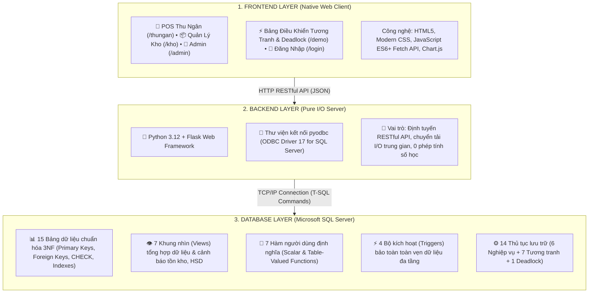

# 🛒 Hệ Quản Trị CSDL & Điều Khiển Tương Tranh - Siêu Thị Bách Hóa Xanh

Hệ thống quản lý chuỗi siêu thị bán lẻ thực phẩm và hàng tiêu dùng nhanh (FMCG) **Bách Hóa Xanh**, được xây dựng chuẩn mực theo mô hình **Database-First** phục vụ môn học **Hệ Quản Trị Cơ Sở Dữ Liệu**:
- **100% logic nghiệp vụ và tính toán được đẩy xuống Microsoft SQL Server**: Toàn bộ các công thức tính thành tiền, chiết khấu khuyến mãi %, kiểm tra voucher quà tặng, quy đổi điểm thưởng thành viên, phân hạng khách hàng, giải thuật trừ kho FIFO và ghi vết audit giá đều được lập trình bằng các đối tượng nâng cao: **Tables, Views, Functions, Stored Procedures và Triggers**.
- **Backend Python Flask là Pure I/O Server**: Đảm nhận nhận request HTTP từ Client, gọi thủ tục/hàm trong SQL Server qua thư viện `pyodbc` và trả kết quả JSON; **hoàn toàn không can thiệp bất kỳ phép toán số học nào** (được kiểm chứng độc lập qua phân tích cây cú pháp trừu tượng AST).
- **Phân hệ Demo Tương Tranh & Deadlock (Concurrency Control & Deadlock Hub)**: Mô phỏng trực quan **4 lỗi truy xuất đồng thời kinh điển (Chương 3)** (Lost Update, Dirty Read, Non-repeatable Read, Phantom Read) và **Khóa chết Deadlock (Chương 4)** dựa trên chu trình đồ thị chờ (Waiting Graph - Lỗi 1205) cùng giải pháp khắc phục triệt để bằng **Giao thức sắp xếp thứ tự (Ordering Protocol)**.

---

## 🏛️ Kiến Trúc Hệ Thống (3-Tier Decoupled)


---

## 📋 Danh Mục 15 Bảng Dữ Liệu (Chuẩn Hóa 3NF)

| STT | Tên Bảng | Khóa Chính (PK) | Khóa Ngoại (FK) | Ý nghĩa nghiệp vụ trong hệ thống |
| :---: | :--- | :--- | :--- | :--- |
| 1 | **`DANH_MUC`** | `MaDanhMuc` | - | Phân loại ngành hàng (Rau củ, Thịt cá, Thực phẩm đông lạnh, Hóa mỹ phẩm...). |
| 2 | **`SAN_PHAM`** | `MaSP` | `MaDanhMuc` | Danh mục hàng hóa, đơn vị tính, giá bán niêm yết, cờ `LaHangTuoiSong`, `MaNVSuaCuoi`, `NgaySuaCuoi`. |
| 3 | **`NHA_CUNG_CAP`** | `MaNCC` | - | Đối tác cung cấp nguồn hàng, số điện thoại, địa chỉ trụ sở. |
| 4 | **`LO_HANG`** | `MaLo` *(Identity)* | `MaSP` | Quản lý tồn kho theo lô: `NgaySanXuat`, `HanSuDung`, `GiaNhap`, `SoLuongTon`. |
| 5 | **`NHAN_VIEN`** | `MaNV` | - | Tài khoản nhân sự, chức vụ, mật khẩu mã hóa, phân quyền (`Role 0: Admin`, `Role 2: Kho`, `Role 1: Thu ngân/Demo`). |
| 6 | **`KHACH_HANG`** | `MaKH` *(Identity)* | - | Hội viên thân thiết, `SoDienThoai` (UNIQUE), `DiemTichLuy`, `HangThanhVien`. |
| 7 | **`KHUYEN_MAI`** | `MaKM` | - | Chương trình ưu đãi giảm giá theo % trong khoảng thời gian có hiệu lực. |
| 8 | **`KM_SAN_PHAM`** | `(MaKM, MaSP)` | `MaKM`, `MaSP` | Bảng liên kết xác định các sản phẩm được áp dụng chương trình khuyến mãi. |
| 9 | **`VOUCHER`** | `MaVoucher` | `MaSPTang` | Phiếu ưu đãi giảm % đơn hàng (`PERCENT`) hoặc tặng kèm sản phẩm miễn phí (`GIFT`). |
| 10 | **`HOA_DON`** | `MaHD` | `MaNV`, `MaKH`, `MaNVSuaCuoi` | Hóa đơn bán lẻ: Tổng tiền hàng, chiết khấu KM, Voucher, điểm dùng, tiền thực thu, phương thức thanh toán. |
| 11 | **`CHI_TIET_HOA_DON`** | `(MaHD, MaSP, MaLo)` | `MaHD`, `MaSP`, `MaLo` | Chi tiết xuất bán, ghi nhận chính xác trừ từ `MaLo` nào theo thuật toán FIFO. |
| 12 | **`PHIEU_NHAP`** | `MaPN` | `MaNV`, `MaNCC`, `MaNVSuaCuoi` | Phiếu nhập kho tổng thể từ nhà cung cấp kèm người lập phiếu và giá trị vốn. |
| 13 | **`CHI_TIET_PHIEU_NHAP`** | `(MaPN, MaSP)` | `MaPN`, `MaSP` | Chi tiết mặt hàng nhập kho, số lượng, đơn giá vốn nhập, NSX và HSD của lô nhập. |
| 14 | **`HANG_TIEU_HUY`** | `MaTieuHuy` *(Identity)* | `MaSP`, `MaLo`, `MaNV` | Lưu vết chi tiết các đợt tiêu hủy hàng hóa bị hư hỏng hoặc quá hạn sử dụng. |
| 15 | **`BANG_LOG_GIA`** | `MaLog` *(Identity)* | `MaSP` | Bảng Audit tự động ghi nhận mọi lịch sử biến động giá bán. |

---

## ⚙️ Các Đối Tượng Lập Trình Cơ Sở Dữ Liệu

### 1. Khung Nhìn (Views) - 7 Views
| Tên View | Vai trò & Nghiệp vụ phục vụ |
| :--- | :--- |
| **`v_SanPhamSieuThi`** | Tổng hợp sản phẩm, tên ngành hàng, giá niêm yết, giá sau khuyến mãi hiện hành và tổng tồn kho còn hạn sử dụng phục vụ quầy POS. |
| **`v_CanhBaoTonKho`** | Cảnh báo các sản phẩm có tổng lượng tồn kho dưới ngưỡng an toàn ($\le$ 10 đơn vị). |
| **`v_CanhBaoHanSD`** | Phân loại trạng thái hạn dùng của từng lô: `Đã hết hạn`, `Cận date (<= 7 ngày)`, `Bình thường`. |
| **`v_DoanhThuTheoNgay`** | Báo cáo doanh thu thực tế, tiền hàng, chiết khấu KM, voucher và điểm dùng theo từng ngày cho biểu đồ Chart.js. |
| **`v_DoanhThuTheoDanhMuc`** | Thống kê sản lượng tiêu thụ và tổng doanh thu phân bổ theo từng danh mục ngành hàng. |
| **`v_TopSanPhamBanChay`** | Xếp hạng Top các sản phẩm có số lượng xuất kho cao nhất cùng tổng doanh thu mang lại. |
| **`v_BaoCaoHieuSuatNhanVien`**| Thống kê tổng số hóa đơn và tổng doanh số mà từng thu ngân thực hiện. |

### 2. Hàm Do Người Dùng Định Nghĩa (Functions) - 7 Functions
| Tên Function | Phân loại | Tham số | Nghiệp vụ xử lý cốt lõi |
| :--- | :---: | :--- | :--- |
| **`fn_SinhMaHoaDon`** | Scalar | *Không* | Tự động sinh mã hóa đơn duy nhất dạng `HD_yyyyMMdd_HHmmss_fff`. |
| **`fn_SinhMaPhieuNhap`** | Scalar | *Không* | Tự động sinh mã phiếu nhập duy nhất dạng `PN_yyyyMMdd_HHmmss_fff`. |
| **`fn_TinhTienSauKhuyenMai`** | Scalar | `@MaSP, @GiaGoc` | Tra cứu khuyến mãi hiện hành và trả về giá sau chiết khấu %. |
| **`fn_TinhDiemTichLuy`** | Scalar | `@ThanhTien` | Quy đổi doanh thu thanh toán thành điểm thưởng: Cứ mỗi **1.000 VNĐ = 1 điểm** (`FLOOR(@ThanhTien / 1000.0)`). |
| **`fn_XepHangKhachHang`** | Scalar | `@MaKH` | Xếp hạng hội viên dựa trên **tổng chi tiêu lũy kế trong HOA_DON**: **Đồng (< 2tr) $\rightarrow$ Bạc ($\ge$ 2tr) $\rightarrow$ Vàng ($\ge$ 5tr) $\rightarrow$ Kim Cương ($\ge$ 10tr)**. |
| **`fn_KiemTraDieuKienVoucher`** | Scalar | `@MaVoucher, @TongTien` | Kiểm tra voucher còn hạn và tính số tiền giảm giá hợp lệ. |
| **`fn_BaoCaoDoanhThuTheoKhoangNgay`** | Table-Valued | `@TuNgay, @DenNgay` | Báo cáo doanh thu động theo khoảng thời gian tùy chọn từ giao diện Admin. |

### 3. Bộ Kích Hoạt (Triggers) - 4 Triggers
| Tên Trigger | Bảng & Sự kiện | Cơ chế bảo toàn toàn vẹn dữ liệu |
| :--- | :--- | :--- |
| **`trg_SauKhiLapHoaDon`** | `HOA_DON` (AFTER INSERT) | Tự động trừ điểm khách hàng đã dùng thanh toán (1 điểm = 100đ), cộng điểm tích lũy mới, tự động nâng hạng thẻ thành viên theo tổng chi tiêu lũy kế. Rollback nếu điểm bị âm. |
| **`trg_KiemTraHSDKhiBan`** | `CHI_TIET_HOA_DON` (AFTER INSERT, UPDATE) | Tuyệt đối chặn xuất bán sản phẩm thuộc các lô hàng đã quá hạn sử dụng (`HanSuDung < GETDATE()`). |
| **`trg_Audit_GiaSanPham`** | `SAN_PHAM` (AFTER UPDATE) | Tự động bắt sự kiện sửa `GiaBan`, lấy giá cũ từ `deleted` và giá mới từ `inserted`, ghi log vào `BANG_LOG_GIA` kèm phân định rõ người đổi: `admin` khi sửa từ quản trị hoặc `demo` khi chạy kịch bản thử nghiệm tương tranh. |
| **`trg_KiemTraTonKhoKhongAm`** | `LO_HANG` (AFTER UPDATE) | Tuyệt đối ngăn chặn hiện tượng số lượng tồn kho bị âm (`SoLuongTon < 0`). |

### 4. Thủ Tục Lưu Trữ (Stored Procedures) - 14 Procedures

#### A. Thủ tục nghiệp vụ cốt lõi (6 Procedures)
- **`sp_ThanhToanHoaDon`**: Nhận danh sách sản phẩm qua chuỗi JSON (`OPENJSON`), mở Transaction nguyên tử (`BEGIN TRANSACTION ... COMMIT`), duyệt trừ kho theo lô cận date với khóa `UPDLOCK, ROWLOCK`, tính tiền hàng, chiết khấu, voucher, điểm thưởng và xuất hóa đơn an toàn.
- **`sp_BanHangFIFO`**: Xử lý duyệt trừ kho theo nguyên tắc FIFO (lô có hạn sử dụng gần nhất trừ trước).
- **`sp_NhapKho`**: Đóng gói quy trình tạo phiếu nhập, thêm chi tiết phiếu nhập và tạo các lô hàng mới trong một giao tác. Hỗ trợ nhập 1 sản phẩm đơn lẻ và nhập hàng loạt nhiều sản phẩm theo danh mục ngành hàng.
- **`sp_TieuHuyHang`**: Xử lý tiêu hủy hàng hỏng/hết hạn, trừ kho và lưu vết bảng `HANG_TIEU_HUY`. Hỗ trợ tiêu hủy đơn lẻ từng lô hoặc tiêu hủy nhanh hàng loạt tất cả các lô đã hết hạn sử dụng.
- **`sp_SuaChiTietHoaDon`** & **`sp_SuaChiTietPhieuNhap`**: Hiệu chỉnh số lượng sau xuất/nhập kho và cân bằng lại tồn kho tự động.

#### B. Thủ tục Demo Tương Tranh Chương 3 (7 Procedures)
- **`sp_Demo_LostUpdate`**: Mô phỏng Mất cập nhật (Chế độ `'error'` không khóa vs `'fixed'` dùng khóa 2PL `WITH (UPDLOCK, HOLDLOCK)`).
- **`sp_Demo_DirtyRead_Transaction`**: Giao tác sửa tạm tồn kho thành 9999 $\rightarrow$ `WAITFOR DELAY` 5s $\rightarrow$ `ROLLBACK`.
- **`sp_Demo_DirtyRead_Read`**: Giao tác đọc (`'error'` dùng `READ UNCOMMITTED` đọc dữ liệu rác vs `'fixed'` dùng `READ COMMITTED`).
- **`sp_Demo_NonRepeatableRead_Read`**: Giao tác đọc giá sản phẩm 2 lần cách nhau 5s (`'error'` dùng `READ COMMITTED` vs `'fixed'` dùng `REPEATABLE READ`).
- **`sp_Demo_NonRepeatableRead_Update`**: Giao tác tăng giá xen giữa 2 lần đọc.
- **`sp_Demo_PhantomRead_Read`**: Giao tác đếm số hóa đơn 2 lần cách nhau 5s (`'error'` dùng `REPEATABLE READ` vs `'fixed'` dùng `SERIALIZABLE`).
- **`sp_Demo_PhantomRead_Insert`**: Giao tác chèn thêm hóa đơn mới xen giữa 2 lần đếm.

#### C. Thủ tục Demo Deadlock Chương 4 (1 Procedure Chuyên Sâu)
- **`sp_Demo_Deadlock`**: Mô phỏng và xử lý tình huống hai nhân viên kho cùng cập nhật tồn kho nhưng khóa các lô hàng theo thứ tự khác nhau:
  1. `@Mode = 'error'`: Nhân viên kho 1 (Lô 11 $\rightarrow$ Lô 12) và Nhân viên kho 2 (Lô 12 $\rightarrow$ Lô 11). SQL Server Deadlock Monitor phát hiện chu trình đồ thị chờ ($T_1 \leftrightarrow T_2$), chọn 1 giao tác làm **DEADLOCK VICTIM** và `ROLLBACK` với **Mã lỗi 1205**.
  2. `@Mode = 'fixed'`: Triệt tiêu Deadlock bằng **Giao thức sắp xếp thứ tự các đơn vị dữ liệu (Ordering All the Items Protocol)**. Cả hai nhân viên kho cùng chuẩn hóa thứ tự xin khóa tăng dần theo Mã Lô (Lô 11 trước $\rightarrow$ Lô 12 sau) $\rightarrow$ Đồ thị chờ không có chu trình $\rightarrow$ Cả 2 giao tác thành công tuần tự.

---

## 🐞 Bảng Điều Khiển Demo Tương Tranh & Deadlock (Web UI)

Truy cập địa chỉ: `http://127.0.0.1:5000/demo` để trải nghiệm giao diện kiểm thử trực quan:

| STT | Phân Loại Lỗi | Kịch Bản Thử Nghiệm Mô Phỏng | Giải Pháp Xử Lý Cốt Lõi |
| :---: | :--- | :--- | :--- |
| **1** | **LOST UPDATE** | 2 Thu ngân cùng bán SP002 còn tồn = 1 | Khóa 2PL: `WITH (UPDLOCK, HOLDLOCK)` |
| **2** | **DIRTY READ** | Kho sửa tồn 9999 $\rightarrow$ Rollback | Mức cô lập: `READ COMMITTED` |
| **3** | **NON-REPEATABLE READ** | Thu ngân đọc giá SP002 (38k $\rightarrow$ 40k) | Mức cô lập: `REPEATABLE READ` |
| **4** | **PHANTOM READ** | Quản lý đếm Hóa Đơn (+1 hóa đơn ma) | Mức cô lập: `SERIALIZABLE` |
| **5** | **DEADLOCK** | Kho 1 & Kho 2 khóa ngược Lô 11, 12 | **Giao thức sắp xếp thứ tự (Ordering Protocol)** |

### Cách thức kiểm chứng thực nghiệm:
1. **Cách 1 - Trên Giao diện Web (/demo):** Chuyển đổi giữa 2 Tab: **Chương 3 (Điều khiển tương tranh)** và **Chương 4 (Xử lý Deadlock)**. Chọn kịch bản và xem console log thời gian thực.
2. **Cách 2 - Trong SQL Server Management Studio (SSMS):** Mở file `deadlock.sql`, mở 2 cửa sổ Query độc lập, gọi lệnh trực tiếp tại tầng CSDL.

---

## 📁 Cấu Trúc Thư Mục Dự Án

```text
project/
├── static/
│   ├── admin/             # Giao diện quản trị, thống kê KPI & biểu đồ Chart.js
│   ├── thungan/           # Giao diện bán hàng POS cho thu ngân
│   ├── kho/               # Giao diện quản lý nhập kho, lô hàng & tiêu hủy
│   ├── demo/              # Giao diện kiểm thử Concurrency & Deadlock (demo.html, demo.js, demo.css)
│   ├── login/             # Giao diện đăng nhập tập trung & phân quyền
│   └── image/             # Hình ảnh mặt hàng thực tế của siêu thị (/static/image/SPxxx.jpg)
├── scripts/
│   ├── deploy_concurrency_demos.sql # Script triển khai các SP demo tương tranh Chương 3
│   ├── deploy_deadlock.sql          # Script triển khai SP xử lý Deadlock Chương 4
│   └── export_schema_and_seed.py    # Script trích xuất và đồng bộ schema.sql / seed.sql
├── app.py                 # Backend Flask thuần I/O (không tính toán nghiệp vụ)
├── deadlock.sql           # Hướng dẫn & kịch bản thực nghiệm Deadlock chi tiết trên SSMS
├── schema.sql             # Toàn bộ mã nguồn DDL (15 Tables, 7 Views, 7 Funcs, 4 Triggers, 14 Procs)
├── seed.sql               # Dữ liệu mẫu chuẩn mực của siêu thị Bách Hóa Xanh
└── README.md              # Tài liệu báo cáo kiến trúc và hướng dẫn vận hành
```

---

## 🚀 Hướng Dẫn Cài Đặt & Vận Hành

### 1. Khởi tạo Cơ sở dữ liệu trong SQL Server
Mở **SQL Server Management Studio (SSMS)** hoặc chạy qua tiện ích `sqlcmd`:
```bash
# 1. Tạo database QL_BachHoaXanh và khởi tạo toàn bộ đối tượng (Table, View, Func, Trigger, Proc)
sqlcmd -S localhost -E -d QL_BachHoaXanh -i schema.sql

# 2. Nạp dữ liệu mẫu ban đầu
sqlcmd -S localhost -E -d QL_BachHoaXanh -i seed.sql
```

### 2. Cấu hình kết nối cơ sở dữ liệu
Kiểm tra chuỗi kết nối tại đầu file `app.py`:
```python
CONN_STR = (
    "DRIVER={ODBC Driver 17 for SQL Server};"
    "SERVER=NONAME\\SQLEXPRESS;"  # Đổi thành tên SQL Server Instance của bạn
    "DATABASE=QL_BachHoaXanh;"
    "Trusted_Connection=yes;"
    "TrustServerCertificate=yes;"
)
```

### 3. Cài đặt môi trường Python & Khởi chạy Web App
```bash
# Cài đặt các thư viện phụ thuộc
pip install flask pyodbc werkzeug

# Khởi chạy ứng dụng
python app.py
```
Ứng dụng sẽ vận hành tại địa chỉ: `http://127.0.0.1:5000`

---

## 🔑 Tài Khoản Đăng Nhập Mặc Định

| Phân hệ | Tài khoản | Mật khẩu | Phân quyền (Role) | Giao diện tự động chuyển hướng |
| :--- | :--- | :--- | :---: | :--- |
| **Quản trị viên** | `admin` | `admin123` | **0** | Màn hình Quản trị Admin (`/admin`) |
| **Nhân viên Kho** | `kho1` | `kho123` | **2** | Màn hình Quản lý Kho (`/kho`) |
| **Thu ngân 1** | `thungan1` | `thungan123` | **1** | Màn hình Bán hàng POS (`/thungan`) |
| **Thu ngân 2** | `thungan2` | `thungan123` | **1** | Màn hình Bán hàng POS (`/thungan`) |
| **Tài khoản Demo** | `demo` | `demo` | **1** | Kiểm thử Điều khiển tương tranh & Deadlock (`/demo`) |

---

## 📡 Danh Sách API Endpoints Chính

| Phân hệ | Endpoint | Phương thức | Đối tượng CSDL phụ trách |
| :--- | :--- | :---: | :--- |
| **Xác thực** | `/api/login` | `POST` | Bảng `NHAN_VIEN` |
| **Sản phẩm** | `/api/products` | `GET` | View `v_SanPhamSieuThi` |
| **Sản phẩm** | `/api/products` | `POST`, `PUT`, `DELETE` | Bảng `SAN_PHAM`, Trigger `trg_Audit_GiaSanPham` |
| **Tồn kho** | `/api/inventory` | `GET` | Bảng `LO_HANG`, View `v_CanhBaoHanSD` |
| **Tồn kho** | `/api/inventory/low_stock` | `GET` | View `v_CanhBaoTonKho` |
| **Khách hàng** | `/api/customers` | `GET`, `POST`, `PUT`, `DELETE` | Bảng `KHACH_HANG` |
| **Bán hàng POS**| `/api/checkout` | `POST` | Stored Procedure `sp_ThanhToanHoaDon` (JSON) |
| **Nhập kho** | `/api/import` | `POST` | Stored Procedure `sp_NhapKho` (Hỗ trợ đơn lẻ & hàng loạt theo danh mục) |
| **Tiêu hủy** | `/api/inventory/destroy` | `POST` | Stored Procedure `sp_TieuHuyHang` (Hỗ trợ đơn lẻ & tiêu hủy hàng loạt) |
| **Hóa đơn** | `/api/invoices` | `GET`, `PUT` | Bảng `HOA_DON`, Proc `sp_SuaChiTietHoaDon` |
| **Phiếu nhập** | `/api/import_invoices` | `GET`, `PUT` | Bảng `PHIEU_NHAP`, Proc `sp_SuaChiTietPhieuNhap` |
| **Khuyến mãi** | `/api/promotions` | `GET`, `POST`, `PUT`, `DELETE` | Bảng `KHUYEN_MAI`, `KM_SAN_PHAM` |
| **Voucher** | `/api/vouchers` | `GET`, `POST`, `PUT`, `DELETE` | Bảng `VOUCHER` |
| **Nhà cung cấp**| `/api/suppliers` | `GET`, `POST`, `PUT`, `DELETE` | Bảng `NHA_CUNG_CAP` |
| **Audit giá** | `/api/price_logs` | `GET` | Bảng `BANG_LOG_GIA` |
| **Báo cáo** | `/api/revenue` | `GET` | View `v_DoanhThuTheoNgay` |
| **Báo cáo** | `/api/revenue/category` | `GET` | View `v_DoanhThuTheoDanhMuc` |
| **Báo cáo** | `/api/revenue/top_products` | `GET` | View `v_TopSanPhamBanChay` |
| **Báo cáo** | `/api/revenue/staff` | `GET` | View `v_BaoCaoHieuSuatNhanVien` |
| **Báo cáo** | `/api/revenue/range` | `GET` | Table-Valued Function `fn_BaoCaoDoanhThuTheoKhoangNgay` |
| **Tương tranh** | `/api/demo/lost_update` | `GET` | Stored Procedure `sp_Demo_LostUpdate` |
| **Tương tranh** | `/api/demo/dirty_read/transaction` | `GET` | Stored Procedure `sp_Demo_DirtyRead_Transaction` |
| **Tương tranh** | `/api/demo/dirty_read/read` | `GET` | Stored Procedure `sp_Demo_DirtyRead_Read` |
| **Tương tranh** | `/api/demo/non_repeatable_read/read`| `GET` | Stored Procedure `sp_Demo_NonRepeatableRead_Read` |
| **Tương tranh** | `/api/demo/non_repeatable_read/update`| `POST` | Stored Procedure `sp_Demo_NonRepeatableRead_Update` (`manv=demo`) |
| **Tương tranh** | `/api/demo/phantom_read/read` | `GET` | Stored Procedure `sp_Demo_PhantomRead_Read` |
| **Tương tranh** | `/api/demo/phantom_read/insert` | `POST` | Stored Procedure `sp_Demo_PhantomRead_Insert` |
| **Deadlock** | `/api/demo/deadlock` | `GET` | Stored Procedure `sp_Demo_Deadlock` (`mode, tx, malo1, malo2`) |
